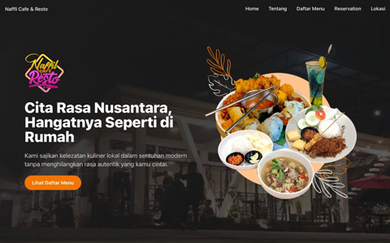

# 🍽️ Naffil Cafe & Resto Menu

**Naffil Menu** adalah Landing Page yang menampilkan daftar menu makanan dan minuman dari Naffil Cafe & Resto. Dibangun dengan NextJS memberikan pengalaman pengguna yang cepat, responsif, dan estetis.

🔗 **Live Demo**: [naffil-menu.vercel.app](https://naffil-menu.vercel.app)



---

## ✨ Fitur Utama

- 📱 **Desain Responsif**: Tampilan optimal di berbagai perangkat, dari smartphone hingga desktop.
- ⚡ **Performa Tinggi**: Memanfaatkan Next.js dan Tailwind CSS untuk kecepatan dan efisiensi.
- 🧩 **Struktur Modular**: Kode terorganisir dengan baik, memudahkan pengembangan dan pemeliharaan.
- 🌐 **Deployment Mudah**: Di-hosting di Vercel untuk kemudahan akses dan pembaruan.

---

## 🛠️ Teknologi yang Digunakan

- [Next.js](https://nextjs.org/) – Framework React untuk aplikasi web modern.
- [Tailwind CSS](https://tailwindcss.com/) – Utility-first CSS framework untuk styling cepat.
- [TypeScript](https://www.typescriptlang.org/) – Superset JavaScript untuk penulisan kode yang lebih aman.
- [Vercel](https://vercel.com/) – Platform hosting untuk aplikasi web frontend.

---

## 🚀 Cara Menjalankan Proyek

1. **Klon repositori ini**:

   ```bash
   git clone https://github.com/izhal27/naffil_menu.git
   cd naffil_menu
   ```

2. **Instal dependensi**:

   ```bash
   npm install
   # atau
   yarn install
   ```

3. **Jalankan server pengembangan**:

   ```bash
   npm run dev
   # atau
   yarn dev
   ```

4. **Buka di browser**:

   Kunjungi [http://localhost:3000](http://localhost:3000) untuk melihat aplikasi.

---

## 📄 Lisensi

Proyek ini dilisensikan di bawah [MIT License](LICENSE).